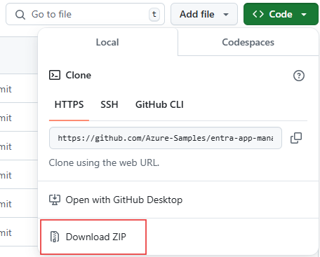

# Secure your tenant from insecure identifier URI configurations on Entra applications

## Mitigation overview

Microsoft Entra ID has released a new protection, available in [app management policies](https://learn.microsoft.com/en-us/graph/api/resources/applicationauthenticationmethodpolicy?view=graph-rest-beta), that you can enable to block the addition of insecure identifier URIs (also referred to as app ID URIs) to app registrations. Enabling this protection is highly recommended and will improve the security of your tenant.  The rest of this document will cover:

- How to enable this protection
- The behavior you should expect when you enable it
- How to grant exemptions if/when needed

This article will describe how to perform each action by running the script provided in this repository (recommended approach).  However, each action can also be performed by directly calling Microsoft Graph APIs, and the article will link to steps using that approach for each action. 

## Prerequisites

- To follow this article, you must be either a Global Administrator or both a Cloud Application Administrator and Security Administrator in your tenant.
- [Powershell 7](https://learn.microsoft.com/en-us/powershell/scripting/install/installing-powershell-on-windows?view=powershell-7.4), also referred to as just 'PowerShell' or 'Powershell Core', installed on your machine.  Don't use Windows PowerShell (also referred to as PowerShell 5.1).
- The [Microsoft Graph Powershell SDK](https://learn.microsoft.com/en-us/graph/sdks/sdk-installation#install-the-microsoft-graph-powershell-sdk) installed on your machine.  If you don't, from a Powershell window, run:
    ```PowerShell
    Install-Module Microsoft.Graph -Scope CurrentUser
    ```
- To run the command that executes this script, you need to get the files in this repo onto your local machine.  There are two ways you can do this.  If you have [git](https://git-scm.com/) installed, you can clone the repo locally.
    1. Open a Powershell 7 window, and navigate to the folder you'd like to store these files in.  For example:
        ```PowerShell
        cd "C:\Users\myUserAccount\source\repos"
        ```
    2. Clone this repository.
        ```PowerShell
        git clone https://github.com/microsoft/entra-apps-identifier-uri-protection.git
        ```
    3. Navigate to this folder.
        ```PowerShell
        cd entra-apps-identifier-uri-protection
        ```

  Or, if you don't have git installed, you can download and extract the files:
    1. Download this repo's files as a ZIP to your local machine
        
    1. Extract them to whatever location you prefer (e.g., "C:\Users\myUserAccount")
    1. Open a Powershell 7 window, and navigate to this folder.
        ```PowerShell
        cd "C:\Users\myUserAccount\entra-apps-identifier-uri-protection-main"
        ```
    1. Unblock these scripts so you can run them on your machine without interruptions.
        ```PowerShell
        dir "C:\Users\myUserAccount\entra-apps-identifier-uri-protection-main" -Recurse | Unblock-File
        ```

## Check if the protection is enabled

> [!NOTE]
> Before following these steps, make sure you've followed the [prerequisites](#prerequisites).

To check if the protection is enabled in your tenant, run this PowerShell command:

```PowerShell
./CheckIdentifierUriProtectionState.ps1
```

When prompted, sign in with your administrator account.  The state of the protection in your tenant will be printed to the console.

## Disable the protection (**Not Recommended**)

> [!NOTE]
> Before following these steps, make sure you've followed the [prerequisites](#prerequisites).

Microsoft will eventually enable this protection in most tenants, unless it detects you have workflows that will be impacted by the enablement.  You can opt-out of this enablement, both before and after it is enabled.

To do so, run this PowerShell command:

```PowerShell
./DisableIdentifierUriProtection.ps1
```

When prompted, sign in with your administrator account.

Once the above command is executed successfully, the protection will be disabled, and Microsoft won't turn it on on your behalf.

Microsoft **does not recommend** disabling this protection.  This protection will improve the security of your tenant.  If you are disabling the protection because the protection caused issues in your organization, consider [granting exemptions](#how-to-grant-exemptions) to blocked apps, users, services or processes instead.

## Enable the protection

> [!NOTE]
> Before following these steps, make sure you've followed the [prerequisites](#prerequisites).

To enable the protection, run this PowerShell command:

```PowerShell
./EnableIdentifierUriProtection.ps1
```

When prompted, sign in with your administrator account.

Once the above command is executed successfully, the protection will be enabled.   Read on to understand the behavior to expect in your tenant once this protection is enabled how to grant exemptions to the protection if/when needed.

See [enable the protection using Graph](/enable-protection-using-graph.md) to learn how to make this same change using the Microsoft Graph API.


## What to expect

This protection is available through [app management policies](https://learn.microsoft.com/en-us/graph/api/resources/applicationauthenticationmethodpolicy?view=graph-rest-beta).   Specifically, it is enabled by setting the [`uriAdditionWithoutUniqueTenantIdentifier` restriction](https://learn.microsoft.com/en-us/graph/api/resources/identifieruriconfiguration?view=graph-rest-beta) in app management policies.

Once this protection is enabled, new identifier URI that are added to v1.0 Entra applications must come in secure formats.  New identifier URIs can still be added if any of the following criteria is met:

- The identifier URI being added to the app is one of the [secure formats](#secure-formats), which generally means the URI contains the app ID, tenant ID, or tenant verified domain in the URI host component.
- The app accepts v2 tokens.  This is true if the app's `api.requestedAccessTokenVersion` property is set to `2`.
- The app is a SAML app.  This is true if the service principal for the app has its `preferredSingleSignOnMode` property set to `SAML`.
- An [exemption has been granted](#how-to-grant-exemptions) to the app the URI is being added to, or to the user or service performing the update.

**Existing identifier URIs already configured on the Entra app won't be affected, and all apps will continue to function as normal.  This will only affect new updates to Entra app configurations.**

### Secure formats

The following API and HTTP scheme-based application ID URI formats are secure. Replace the placeholder values as described in the list following the table.

| Supported application ID <br/> URI formats | Example app ID URIs |
|--|--|
| *api://\<appId\>* | *api://00001111-aaaa-2222-bbbb-3333cccc4444* |
| *api://\<tenantId\>/\<appId\>* | *api://aaaabbbb-0000-cccc-1111-dddd2222eeee/00001111-aaaa-2222-bbbb-3333cccc4444* |
| *api://\<tenantId\>/\<string\>* | *api://aaaabbbb-0000-cccc-1111-dddd2222eeee/api* |
| *api://\<string\>/<appId\>* | *api://productapi/00001111-aaaa-2222-bbbb-3333cccc4444* |
| *https://\<tenantInitialDomain\>.onmicrosoft.com/\<string\>* | *`https://contoso.onmicrosoft.com/productsapi`* |
| *https://\<verifiedCustomDomain\>/\<string\>* |  *`https://contoso.com/productsapi`* |
| *https://\<string\>.\<verifiedCustomDomain\>* |  *`https://product.contoso.com`* |
| *https://\<string\>.\<verifiedCustomDomain\>/\<string\>* | *`https://product.contoso.com/productsapi`*   |
| *api://<string\>.\<verifiedCustomDomainOrInitialDomain\>/\<string\>* | *`api://contoso.com/productsapi`* |

- *\<appId\>* - The application identifier (appId) property of the application object.
- *\<string\>* - The string value for the host or the api path segment.
- *\<tenantId>* - A GUID generated by Azure to represent the tenant within Azure.
- *\<tenantInitialDomain\>* - *\<tenantInitialDomain\>.onmicrosoft.com*, where *\<tenantInitialDomain\>* is the initial domain name the tenant creator specified at tenant creation.
- *\<verifiedCustomDomain\>* - A [verified custom domain](~/fundamentals/add-custom-domain.yml) configured for your Microsoft Entra tenant.

## How to grant exemptions

> [!NOTE]
> Before following these steps, make sure you've followed the [prerequisites](#prerequisites).

If there is an important business scenario blocked by this protection, you can use exemptions to unblock the trusted scenario while keeping your tenant secure.  We strongly recommend using exemptions if you encounter issues enabling the protection, rather than turning off the protection altogether. 

### Grant an app an exemption

The most common exemption you will likely need to grant is to a specific app.  When you grant an app an exemption, it will be able to have identifier URIs added to it, even if the policy would normally otherwise block it.

```PowerShell
./GrantAppExemption -AppId {AppIdOfAppToBeGrantedExemption}
```

See [grant an app exemption](/grant-app-exemption.md) to learn how to make this same change using the Microsoft Graph API.

### Grant a user, service, or process an exemption

You might encounter a scenario where you need to grant a specific caller an exemption to this protection.   When you grant a caller an exemption, all of the Entra app creation and update operations done by that user or service will be exempt from rules blocking identifier URI addition, regardless of which app is being created or updated.  

#### Additional prerequisites

To grant this exemption, you need two directory roles, in addition to the `Global Administrator`, `Application Administrator`, or `Cloud App Administrator` role from [Prerequisites](#prerequisites):

- [Attribute Definition Administrator](https://learn.microsoft.com/en-us/entra/identity/role-based-access-control/permissions-reference#attribute-definition-administrator)
- [Attribute Assignment Administrator](https://learn.microsoft.com/en-us/entra/identity/role-based-access-control/permissions-reference#attribute-assignment-administrator)

See [Assign Microsoft Entra roles to users](https://learn.microsoft.com/en-us/entra/identity/role-based-access-control/manage-roles-portal) to learn how to grant directory roles.

#### Grant the exemption

```PowerShell
./GrantCallerExemption -Id {IdOfUserOrServicePrincipal}
```

Once this completes, the user or service principal will be able to add an identifier URI to any app they have access to.

This operation will create a [custom security attribute](https://learn.microsoft.com/en-us/entra/fundamentals/custom-security-attributes-overview) in your tenant, and assign it to the user or service principal.  If you would rather use an existing custom security attribute from your tenant, run this command instead:

```PowerShell
./GrantCallerExemption -Id {IdOfUserOrServicePrincipal} -CustomSecurityAttributeSet {AttributeSetName} -CustomSecurityAttributeName {AttributeName} -CustomSecurityAttributeValue {AttributeValue}
```

See [grant a caller exemption](/grant-caller-exemption.md) to learn how to make this same change using the Microsoft Graph API.
